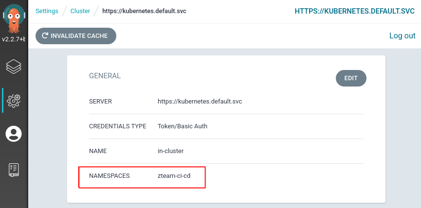

# ArgoCD and Team Topologies

In [Team Topologies](https://teamtopologies.com/) the `Product Team` is a stream aligned team that focusses on application(s) that compose a business service.

The `Platform Team` is usually composed of Infra-Ops-SRE folks that help provision infrastructure in a `self-service` fashion for the varying product teams.

The interaction between these two teams is commonly an `API` - that is the platform team provide services that the product teams can consume in a self-service manner.

ArgoCD is a commonly used `GitOps` tool that allows teams to declaratively manage the deployments of their applications, middleware and tooling from source code.

## Background on OpenShift GitOps Operator

When you install the RedHat GitOps Operator, it provisions for you a single cluster scoped ArgoCD instance in the `gitops-operator` namespace. There are basically two service accounts that matter with ArgoCD:

_Cluster Scoped ArgoCD_

- the `application-controller` - this is the backend controller service account
- the `argocd-server` - this is the UI service account

These are bound to RBAC that can be found [here](FIXME).

_Namespaced Scoped ArgoCD_

When you deploy team based ArgoCD i.e. using the operator, but as a project admin (normal user) - your cluster connection is `namespaced`. This means you cannot create cluster resources (such as projects) with your ArgoCD.

Let's examine some common patterns of deployment with different trade offs in terms of cluster permissions.

## Helm Setup & Bootstrap Projects

In the examples that follow we use the following helm chart repository. Add it now to your local config:

```bash
# add the eformat repository
helm repo add eformat https://eformat.github.io/helm-charts
```

There are four teams in the examples:

- `ops-sre` - this is the platform team. they operate at cluster scope and use the ArgoCD in the `openshift-gitops` namespace.
- `xteam, yteam, zteam` - these are our stream aligned product teams. they operate at cluster or namespaced scope and use ArgoCD in their `*-ci-cd` namespace.

There are many ways to create the team projects. `oc new-project` works as well. We make use of the [bootstrap project chart](https://github.com/redhat-cop/helm-charts/tree/master/charts/bootstrap-project) in the redhat-cop which manages role bindings for our teams. The groups would come from LDAP/OAuth providers and be provisioned on OpenShift already.

Let's create the projects configurations:

```bash
# create namespaces using bootstrap-project chart
cat <<EOF > /tmp/bootstrap-values.yaml
namespaces:
- name: xteam-ci-cd
  operatorgroup: true
  bindings:
  - name: labs-devs
    kind: Group
    role: edit
  - name: labs-admins
    kind: Group
    role: admin
  namespace: xteam-ci-cd
- name: yteam-ci-cd
  operatorgroup: true
  bindings:
  - name: labs-devs
    kind: Group
    role: edit
  - name: labs-admins
    kind: Group
    role: admin
  namespace: yteam-ci-cd
- name: zteam-ci-cd
  operatorgroup: true
  bindings:
  - name: labs-devs
    kind: Group
    role: edit
  - name: labs-admins
    kind: Group
    role: admin
  namespace: zteam-ci-cd
serviceaccounts:
EOF
```

There are multiple ways to deploy the helm chart - we could just install it in our cluster:

```bash
# bootstrap our projects
helm upgrade --install bootstrap \
  redhat-cop/bootstrap-project \
  -f /tmp/bootstrap-values.yaml \
  --namespace argocd --create-namespace
```

Else we could use a cluster-scope ArgoCD instance and an `Application`:

```bash
# bootstrap namespaces using ops-sre argo instance
cat <<EOF | oc apply -n openshift-gitops -f-
apiVersion: argoproj.io/v1alpha1
kind: Application
metadata:
  finalizers:
  - resources-finalizer.argocd.argoproj.io
  name: bootstrap
spec:
  destination:
    namespace: gitops-operator
    server: https://kubernetes.default.svc
  project: default
  source:
    repoURL: https://redhat-cop.github.io/helm-charts
    targetRevision: 1.0.1
    chart: bootstrap-project
    helm:
      values: |-
$(sed 's/^/        /' /tmp/bootstrap-values.yaml)
  syncPolicy:
    automated:
      prune: true
      selfHeal: true
    syncOptions:
    - Validate=true
EOF
```

You can choose which option suits !

**NOTE** You must deploy the namespaces first for each example below.

It may also be desireable for the teams to own the creation of namespaces which we will cover along the way.

## Cluster ArgoCD for Everyone


In this pattern there is a `cluster scoped` ArgoCD instance that the `Platform Team` controls. The helm chart is used to deploy:

- The RedHat GitOps Operator (cluster scoped)
- A Ops-SRE (cluster scoped) ArgoCD instance

We then deploy a chart for the:

- Team (cluster scoped) ArgoCD instances

Individual teams can then use their cluster scoped ArgoCD to deploy their applications, middleware and tooling.

This pattern is useful when:

- High Trust - Teams are trusted at the cluster scope
- A level of isolation is required hence each team get their own ArgoCD instance

Using a `cluster-admin` user, use helm and the `eformat/gitops-operator` chart to deploy an ops-sre (cluster scoped) ArgoCD, and then deploy three team (cluster scoped) ArgoCD instances.

```bash
# argocd operator in openshift-operators ns. ops-sre argocd instance in openshift-gitops ns. helm chart in argocd ns. no team argos.
helm upgrade --install argocd \
  eformat/gitops-operator \
  --set operator.disableDefaultArgoCD=false \
  --set namespaces={'xteam-ci-cd,yteam-ci-cd,zteam-ci-cd'} \
  --namespace argocd --create-namespace
```

Once deployed we should see four argocd instances:

```bash
oc get argocd --all-namespaces

NAMESPACE          NAME               AGE
openshift-gitops   openshift-gitops   3m
xteam-ci-cd        argocd             3m
yteam-ci-cd        argocd             3m
zteam-ci-cd        argocd             3m
```

## Don't deploy Platform ArgoCD, Cluster ArgoCD per Team

In this pattern the ops-sre instance is not required.


We then deploy a chart for the:

- The RedHat GitOps Operator (cluster scoped)
- Team (cluster scoped) ArgoCD instances

Individual teams can use their cluster scoped ArgoCD to deploy their applications, middleware and tooling.

This pattern is useful when:

- High Trust - Teams are trusted at the cluster scope
- A level of isolation is required hence each team get their own ArgoCD instance
- Teams can self-administer their ArgoCD with little assistance from Ops-SRE

Using a `cluster-admin` user, use helm and the `eformat/gitops-operator` chart to deploy three team (cluster scoped) ArgoCD instances.

```bash
# deploy the operator, and team instances
helm upgrade --install teams-argocd \
  eformat/gitops-operator \
  --set namespaces={"xteam-ci-cd,yteam-ci-cd,zteam-ci-cd"} \
  --namespace argocd
```

Once deployed we should see three argocd instances:

```bash
oc get argocd --all-namespaces

NAMESPACE     NAME     AGE
xteam-ci-cd   argocd   3m
yteam-ci-cd   argocd   3m
zteam-ci-cd   argocd   3m
```

## Platform ArgoCD, Namespaced ArgoCD per Team

This is the default pattern you get out of the box with OpenShift.


In this pattern there is a `cluster scoped` ArgoCD instance that the `Platform Team` controls. The helm chart is used to deploy:

- The RedHat GitOps Operator (cluster scoped)
- A Ops-SRE (cluster scoped) ArgoCD instance
- Team (namespaces scoped) ArgoCD instances

Individual teams can then use their cluster scoped ArgoCD to deploy their applications, middleware and tooling, but `cannot deploy cluster-scoped` resources e.g. teams cannot deploy `namespaces or projects`.

This pattern is useful when:

- Medium Trust - Teams are trusted to admin their own namespaces which are provisioned for them by the platform team.
- A level of isolation is required hence each team get their own ArgoCD instance

Using a `cluster-admin` user, use helm and the `eformat/gitops-operator` chart to deploy an ops-sre (cluster scoped) ArgoCD, and then deploy three team (cluster scoped) ArgoCD instances.

```bash
# deploy the operator, ops-sre instance, namespaced scoped team instances
helm upgrade --install argocd \
  eformat/gitops-operator \
  --set operator.disableDefaultArgoCD=false \
  --set namespaces={"xteam-ci-cd,yteam-ci-cd,zteam-ci-cd"} \
  --set teamInstancesAreClusterScoped=false \
  --namespace argocd --create-namespace
```

Once deployed we should see four argocd instances:

```bash
oc get argocd --all-namespaces

NAMESPACE          NAME               AGE
openshift-gitops   openshift-gitops   2m35s
xteam-ci-cd        argocd             2m35s
yteam-ci-cd        argocd             2m35s
zteam-ci-cd        argocd             2m35s
```

The thing to note with the team ArgoCD's is their `cluster` connection is namespace scoped e.g. for the `zteam-ci-cd` instance:



## Don't deploy Platform ArgoCD, Namespaced ArgoCD per Team

In this pattern the ops-sre instance is not required.


We then deploy a chart for the:

- The RedHat GitOps Operator (cluster scoped)
- Team (namespaces scoped) ArgoCD instances

Individual teams can use their namespaces scoped ArgoCD to deploy their applications, middleware and tooling.

This pattern is useful when:

- Medium Trust - Teams are trusted to admin their own namespaces which are provisioned for them by the platform team.
- A level of isolation is required hence each team get their own ArgoCD instance

Using a `cluster-admin` user, use helm and the `eformat/gitops-operator` chart to deploy three team (cluster scoped) ArgoCD instances.

```bash
# deploy the operator, namespaced scoped team instances
helm upgrade --install argocd \
  eformat/gitops-operator \
  --set namespaces={"xteam-ci-cd,yteam-ci-cd,zteam-ci-cd"} \
  --set teamInstancesAreClusterScoped=false \
  --namespace argocd --create-namespace
```

Once deployed we should see three argocd instances:

```bash
oc get argocd --all-namespaces

NAMESPACE     NAME     AGE
xteam-ci-cd   argocd   17s
yteam-ci-cd   argocd   17s
zteam-ci-cd   argocd   17s
```

The thing to note with the team ArgoCD's is their `cluster` connection is namespace scoped e.g. for the `zteam-ci-cd` instance:


## One ArgoCD To Rule Them All


```bash
# add the eformat repository
helm repo add eformat https://eformat.github.io/helm-charts
```

## Using Custom RBAC for Team ArgoCD

We can also customize the RBAC for our ArgoCD team instances. As a default, the helm chart currently sets cluster-admin role for the controller:

```yaml
rules:
- apiGroups:
  - '*'
  resources:
  - '*'
  verbs:
  - '*'
- nonResourceURLs:
  - '*'
  verbs:
  - '*'
```

Let's imagine we want to apply a slightly more restricted RBAC for teams ArgoCD e.g. the same RBAC as the current default `ClusterRole` rules that get applied for the ops-sre ArgoCD instance.

We have placed these Role rules in two files in this repo:

- `controller-cluster-rbac-rules.yaml` - role rules for the backend controller service account
- `server-cluster-rbac-rules.yaml` - roles rules for the UI service account

```bash
# deploy the operator, namespaced scoped team instances
helm upgrade --install argocd \
  eformat/gitops-operator \
  --set namespaces={"xteam-ci-cd,yteam-ci-cd,zteam-ci-cd"} \
  --set clusterRoleRulesController=()
  --namespace argocd --create-namespace
```

## Cleanup

```bash
helm delete argocd -n argocd
helm delete bootstrap -n argocd
oc delete project argocd
project-finalize.sh argocd
oc delete csv openshift-gitops-operator.v1.4.3 -n openshift-operators
oc patch argocds.argoproj.io openshift-gitops -n openshift-gitops --type='json' -p='[{"op": "remove" , "path": "/metadata/finalizers" }]'
oc delete project openshift-gitops
project-finalize.sh openshift-gitops
project-finalize.sh xteam-ci-cd
project-finalize.sh yteam-ci-cd
project-finalize.sh zteam-ci-cd
```