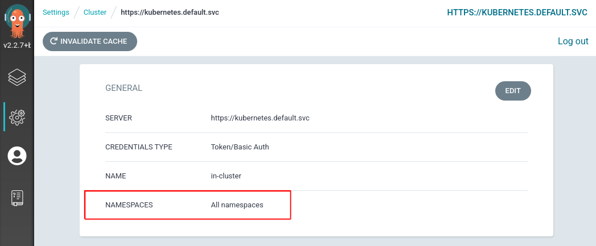
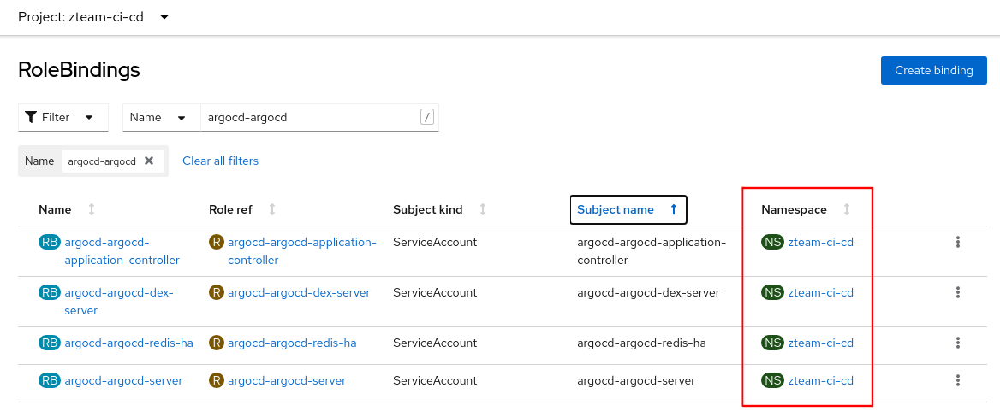
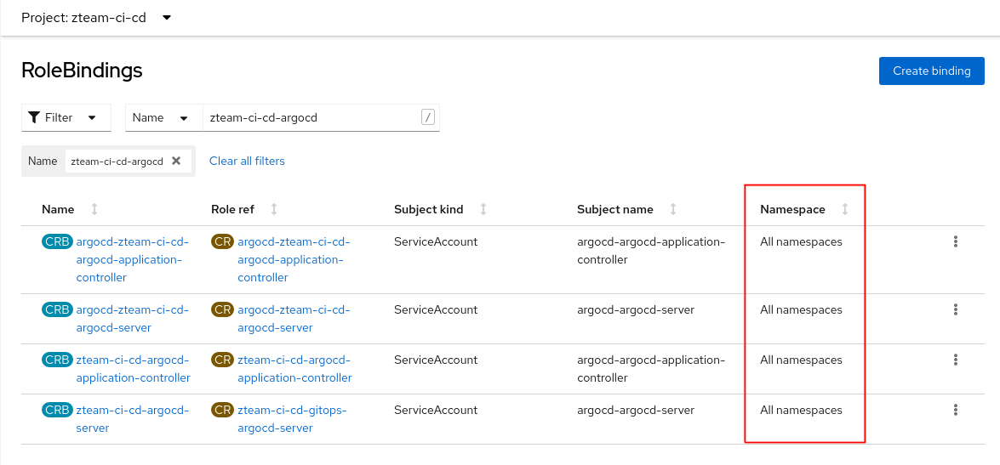

# ArgoCD and Team Topologies

Aligning how we setup our GitOps tooling deployment with the structure of our team's is a tricky job, especially when it comes to permissions, RBAC on OpenShift and some of the default's that the RedHat `gitops-operator` set for us. This README discusses how we can use the `redhat-cop/gitops-operator` chart to better align our deployments with our teams.

In [Team Topologies](https://teamtopologies.com/) the `Product Team` is a stream aligned team that focusses on application(s) that compose a business service.

The `Platform Team` is usually composed of Infra-Ops-SRE folks that help provision infrastructure in a `self-service` fashion for the varying product teams.

The interaction between these two teams is commonly an `API` - that is the platform team provide services that the product teams can consume in a self-service manner.

ArgoCD is a commonly used `GitOps` tool that allows teams to declaratively manage the deployments of their applications, middleware and tooling from source code.

## Background on OpenShift GitOps Operator and RBAC

There are basically two service accounts that matter with ArgoCD (there are two other's for `dex` and `redis` which we don't need to focus on for this discussion):

- the `application-controller` service account - this is the backend controller service account
- the `argocd-server` service account - this is the UI service account

The `Cluster` connection settings in ArgoCD are controlled by the RedHat `gitops-operator`. By default the operator will provision a single cluster scoped ArgoCD instance in the `gitops-operator` namespace.

The RBAC that is associated with the the default instance does not give you `custer-admin`, although the privileges are pretty wide.

_Cluster Scoped ArgoCD_

You can tell if your ArgoCD instance is able to see `All namespaces` in the cluster be examining the default connection under `Settings > Cluster`



_Namespaced Scoped ArgoCD_

As a normal team user (a project admin), when you deploy ArgoCD using the operator, your cluster connection is `namespaced`. This means that your ArgoCD can only control objects listed in the comma separated list of  `NAMESPACES` against the cluster connection. Your ArgoCD cannot access cluster resources i.e. for example it cannot create `projects or namespaces`. For example, the `zteam-ci-cd` ArgoCD instance in `namespaced` mode:


## redhat-cop/gitops-operator Helm Chart

We have created a helm chart that allows finer grained control of our team based ArgoCD instances. In particular, it allows us to configure the `gitops-operator` Subscription so that we may deploy cluster scoped team instances of ArgoCD as well as provide finer grained RBAC control e.g. full `cluster-admin`, or just a subset of Role rules. We can control the cluster connection mode as whether to deploy a default ArgoCD instance by manipulating the environment variables set on the `gitops-operator` Subscription:

```yaml
  config:
    env:
      - name: DISABLE_DEFAULT_ARGOCD_INSTANCE
        value: 'true'
      - name: ARGOCD_CLUSTER_CONFIG_NAMESPACES
        value: 'xteam-ci-cd,yteam-ci-cd,zteam-ci-cd'
```

## Common Patterns of Deployment

Let's examine some common patterns of deployment with different trade offs in terms of cluster permissions.

### Helm Setup & Bootstrap Projects

In the examples that follow we use the following helm chart repository. Add it now to your local config:

```bash
# add the eformat repository
helm repo add eformat https://eformat.github.io/helm-charts
```

There are four teams in the examples:

- `ops-sre` - this is the platform team. they operate at cluster scope and use the ArgoCD in the `openshift-gitops` namespace.
- `xteam, yteam, zteam` - these are our stream aligned product teams. they operate at cluster or namespaced scope and use ArgoCD in their `*-ci-cd` namespace.

There are many ways to create the team projects. `oc new-project` works well!. We can make use of the [bootstrap project chart](https://github.com/redhat-cop/helm-charts/tree/master/charts/bootstrap-project) in the redhat-cop that manages the role bindings and namespaces for our teams. In a normal setup the Groups would come from LDAP/OAuth providers and be provisioned on OpenShift already.

Let's create the projects configurations:

```bash
# create namespaces using bootstrap-project chart
cat <<EOF > /tmp/bootstrap-values.yaml
namespaces:
- name: xteam-ci-cd
  operatorgroup: true
  bindings:
  - name: labs-devs
    kind: Group
    role: edit
  - name: labs-admins
    kind: Group
    role: admin
  namespace: xteam-ci-cd
- name: yteam-ci-cd
  operatorgroup: true
  bindings:
  - name: labs-devs
    kind: Group
    role: edit
  - name: labs-admins
    kind: Group
    role: admin
  namespace: yteam-ci-cd
- name: zteam-ci-cd
  operatorgroup: true
  bindings:
  - name: labs-devs
    kind: Group
    role: edit
  - name: labs-admins
    kind: Group
    role: admin
  namespace: zteam-ci-cd
serviceaccounts:
EOF
```

There are multiple ways to deploy the helm chart - just install it in our cluster (do this for now):

```bash
# bootstrap our projects
helm upgrade --install bootstrap \
  redhat-cop/bootstrap-project \
  -f /tmp/bootstrap-values.yaml \
  --namespace argocd --create-namespace
```

else we could use a cluster-scope ArgoCD instance and an `Application` if that existed already:

```bash
# bootstrap namespaces using ops-sre argo instance
cat <<EOF | oc apply -n openshift-gitops -f-
apiVersion: argoproj.io/v1alpha1
kind: Application
metadata:
  finalizers:
  - resources-finalizer.argocd.argoproj.io
  name: bootstrap
spec:
  destination:
    namespace: gitops-operator
    server: https://kubernetes.default.svc
  project: default
  source:
    repoURL: https://redhat-cop.github.io/helm-charts
    targetRevision: 1.0.1
    chart: bootstrap-project
    helm:
      values: |-
$(sed 's/^/        /' /tmp/bootstrap-values.yaml)
  syncPolicy:
    automated:
      prune: true
      selfHeal: true
    syncOptions:
    - Validate=true
EOF
```

**NOTE** You must deploy these namespaces first for each of the examples below.

It may also be desireable for the teams to own the creation of namespaces which is not covered here, however that is easily done by altering the methods above.

### Cluster ArgoCD for Everyone


In this pattern there is a `cluster scoped` ArgoCD instance that the `Platform Team` controls. The helm chart is used to deploy:

- The RedHat GitOps Operator (cluster scoped)
- A Ops-SRE (cluster scoped) ArgoCD instance
- Team (cluster scoped) ArgoCD instances

Individual teams can then use their cluster scoped ArgoCD to deploy their applications, middleware and tooling.

This pattern is useful when:

- High Trust - Teams are trusted at the cluster scope
- A level of isolation is required hence each team get their own ArgoCD instance

Deploy the team bootstrap namespaces as above.

Using a `cluster-admin` user, use helm and the `eformat/gitops-operator` chart to deploy an ops-sre (cluster scoped) ArgoCD, and then deploy three team (cluster scoped) ArgoCD instances.

```bash
# argocd operator in openshift-operators ns. ops-sre argocd instance in openshift-gitops ns. helm chart in argocd ns. no team argos.
helm upgrade --install argocd \
  eformat/gitops-operator \
  --set operator.disableDefaultArgoCD=false \
  --set namespaces={'xteam-ci-cd,yteam-ci-cd,zteam-ci-cd'} \
  --namespace argocd --create-namespace
```

Once deployed we should see four argocd instances:

```bash
oc get argocd --all-namespaces

NAMESPACE          NAME               AGE
openshift-gitops   openshift-gitops   3m
xteam-ci-cd        argocd             3m
yteam-ci-cd        argocd             3m
zteam-ci-cd        argocd             3m
```

### Don't deploy Platform ArgoCD, Cluster ArgoCD per Team

In this pattern the ops-sre instance is not required.


We use a helm chart that deploys:

- The RedHat GitOps Operator (cluster scoped)
- Team (cluster scoped) ArgoCD instances

Individual teams can use their cluster scoped ArgoCD to deploy their applications, middleware and tooling.

This pattern is useful when:

- High Trust - Teams are trusted at the cluster scope
- A level of isolation is required hence each team get their own ArgoCD instance
- Teams can self-administer their ArgoCD with little assistance from Ops-SRE

Deploy the team bootstrap namespaces as above.

Using a `cluster-admin` user, use helm and the `eformat/gitops-operator` chart to deploy three team (cluster scoped) ArgoCD instances.

```bash
# deploy the operator, and team instances
helm upgrade --install teams-argocd \
  eformat/gitops-operator \
  --set namespaces={"xteam-ci-cd,yteam-ci-cd,zteam-ci-cd"} \
  --namespace argocd
```

Once deployed we should see three argocd instances:

```bash
oc get argocd --all-namespaces

NAMESPACE     NAME     AGE
xteam-ci-cd   argocd   3m
yteam-ci-cd   argocd   3m
zteam-ci-cd   argocd   3m
```

### Platform ArgoCD, Namespaced ArgoCD per Team

This is the default pattern you get out of the box with OpenShift.


In this pattern there is a `cluster scoped` ArgoCD instance that the `Platform Team` controls. The helm chart is used to deploy:

- The RedHat GitOps Operator (cluster scoped)
- A Ops-SRE (cluster scoped) ArgoCD instance
- Team (namespaces scoped) ArgoCD instances

Individual teams can then use their cluster scoped ArgoCD to deploy their applications, middleware and tooling, but `cannot deploy cluster-scoped` resources e.g. teams cannot deploy `namespaces or projects` as they are cluster scoped.

This pattern is useful when:

- Medium Trust - Teams are trusted to admin their own namespaces which are provisioned for them by the platform team.
- A level of isolation is required hence each team get their own ArgoCD instance

Deploy the team bootstrap namespaces as above.

Using a `cluster-admin` user, use helm and the `eformat/gitops-operator` chart to deploy an ops-sre (cluster scoped) ArgoCD, and then deploy three team (cluster scoped) ArgoCD instances.

```bash
# deploy the operator, ops-sre instance, namespaced scoped team instances
helm upgrade --install argocd \
  eformat/gitops-operator \
  --set operator.disableDefaultArgoCD=false \
  --set namespaces={"xteam-ci-cd,yteam-ci-cd,zteam-ci-cd"} \
  --set teamInstancesAreClusterScoped=false \
  --namespace argocd --create-namespace
```

Once deployed we should see four argocd instances:

```bash
oc get argocd --all-namespaces

NAMESPACE          NAME               AGE
openshift-gitops   openshift-gitops   2m35s
xteam-ci-cd        argocd             2m35s
yteam-ci-cd        argocd             2m35s
zteam-ci-cd        argocd             2m35s
```

The thing to note with the team ArgoCD's is their `cluster` connection is namespace scoped.

For a given team ArgoCD, what we see is all of the namespace Role Binding's applied from the `gitops-operator`:



### Don't deploy Platform ArgoCD, Namespaced ArgoCD per Team

In this pattern the ops-sre instance is not required.


We use a helm chart that deploys:

- The RedHat GitOps Operator (cluster scoped)
- Team (namespaces scoped) ArgoCD instances

Individual teams can use their namespaces scoped ArgoCD to deploy their applications, middleware and tooling.

This pattern is useful when:

- Medium Trust - Teams are trusted to admin their own namespaces which are provisioned for them by the platform team.
- A level of isolation is required hence each team get their own ArgoCD instance

Deploy the team bootstrap namespaces as above.

Using a `cluster-admin` user, use helm and the `eformat/gitops-operator` chart to deploy three team (cluster scoped) ArgoCD instances.

```bash
# deploy the operator, namespaced scoped team instances
helm upgrade --install argocd \
  eformat/gitops-operator \
  --set namespaces={"xteam-ci-cd,yteam-ci-cd,zteam-ci-cd"} \
  --set teamInstancesAreClusterScoped=false \
  --namespace argocd --create-namespace
```

Once deployed we should see three argocd instances:

```bash
oc get argocd --all-namespaces

NAMESPACE     NAME     AGE
xteam-ci-cd   argocd   17s
yteam-ci-cd   argocd   17s
zteam-ci-cd   argocd   17s
```

The thing to note with the team ArgoCD's is their `cluster` connection is namespace scoped.

### One ArgoCD To Rule Them All

In this pattern the ops-sre instance is the only one deployed.


We use a helm chart that deploys:

- The RedHat GitOps Operator (cluster scoped)
- A Ops-SRE (cluster scoped) ArgoCD instance

Everyone will need to be given access to the `openshift-gitops` namespace.

This pattern is useful when:

- High Trust - everyone shares one privileged ArgoCD instance.
- No isolation required

Using a `cluster-admin` user, use helm and the `eformat/gitops-operator` chart to deploy one (cluster scoped) ArgoCD instance.

```bash
# deploy the operator, cluster scoped ops-sre instance
helm upgrade --install argocd \
  eformat/gitops-operator \
  --set namespaces= \
  --set operator.disableDefaultArgoCD=false \
  --namespace argocd --create-namespace
```

### Using Custom RBAC for Team ArgoCD

We can also customize the RBAC for our ArgoCD team instances. As a default, the helm chart currently sets cluster-admin role for the controller:

```yaml
rules:
- apiGroups:
  - '*'
  resources:
  - '*'
  verbs:
  - '*'
- nonResourceURLs:
  - '*'
  verbs:
  - '*'
```

Let's imagine we want to apply a slightly more restricted RBAC for teams ArgoCD e.g. the same RBAC as the current default `ClusterRole` rules that get applied for the ops-sre ArgoCD instance.

We have placed these Role rules in two files in this repo:

- `controller-cluster-rbac-rules.yaml` - role rules for the backend controller service account
- `server-cluster-rbac-rules.yaml` - roles rules for the UI service account

Lets create a custom values file for our helm chart:

```bash
cat <<EOF > /tmp/custom-values.yaml
namespaces:
  - xteam-ci-cd
  - yteam-ci-cd
  - zteam-ci-cd
clusterRoleRulesServer:
$(sed 's/^/  /' server-cluster-rbac-rules.yaml)
clusterRoleRulesController:
$(sed 's/^/  /' controller-cluster-rbac-rules.yaml)
EOF
```

Deploy the team bootstrap namespaces as above.

Using a `cluster-admin` user, use helm and the `eformat/gitops-operator` chart to deploy three team (cluster scoped) ArgoCD instances.

```bash
# deploy the operator, namespaced scoped team instances
helm upgrade --install argocd \
  eformat/gitops-operator \
  -f /tmp/custom-values.yaml \
  --namespace argocd --create-namespace
```

For a given team ArgoCD (cluster scoped), what we are the Cluster Role Binding's applied - two from the `gitops-operator` starting with the name `argocd-*` and two from the helm chart starting with the name `zteam-ci-cd-*` (i have not show the `redis` and `dex` namespaces Role Bindings from the `gitops-operator`):



### Namespaced ArgoCD and Creating projects/namespaces

OpenShift by default allows normal authenticated users to create projects in a self-service manner. This is advantageous for all sorts of reasons related to Continuous Delivery. It is not possible to allow namespaced ArgoCD these same permissions today using the `gitops-operator`, although there is an upstream [enhancement request](https://github.com/redhat-developer/gitops-operator/issues/244) for it.

## Cleanup

Use to `Nuke from orbit`:

```bash
helm delete argocd -n argocd
helm delete bootstrap -n argocd
oc delete project argocd
project-finalize.sh argocd
oc delete csv openshift-gitops-operator.v1.4.3 -n openshift-operators
oc patch argocds.argoproj.io argocd -n xteam-ci-cd --type='json' -p='[{"op": "remove" , "path": "/metadata/finalizers" }]'
oc patch argocds.argoproj.io argocd -n yteam-ci-cd --type='json' -p='[{"op": "remove" , "path": "/metadata/finalizers" }]'
oc patch argocds.argoproj.io argocd -n zteam-ci-cd --type='json' -p='[{"op": "remove" , "path": "/metadata/finalizers" }]'
oc patch argocds.argoproj.io openshift-gitops -n openshift-gitops --type='json' -p='[{"op": "remove" , "path": "/metadata/finalizers" }]'
oc delete project openshift-gitops
project-finalize.sh openshift-gitops
project-finalize.sh xteam-ci-cd
project-finalize.sh yteam-ci-cd
project-finalize.sh zteam-ci-cd
```
